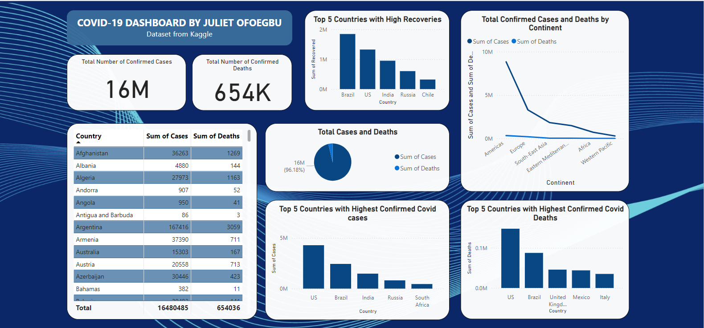

# COVID-19 Data Analysis and Visualization

## Questions to be answered from the analysis and visualization
1. What was the total number of confirmed cases and confirmed deaths in the world?
2. Which countries had the highest number of confirmed cases and confirmed Deaths across the world?
3. At what rate did COVID-19 spread across all the continents in the world?


## STEP 1: DATA COLLECTION
Data was collected from Kaggle website at (https://www.kaggle.com/datasets/imdevskp/corona-virus-report)


## STEP 2: DATA CLEANING USING EXCEL
Cleaned up the dataset a little by renaming some columns for easiER identification


## STEP 3: DATA VALIDATION AND EXPLORATION USING JUPYTER NOTEBOOK
- Renamed some column names
- Checked for missing values
- Validated unique countries
- Checking for total number of confirmed cases and deaths worldwide
- Checking for countries with the highest number of confirmed cases and deaths


## STEP 4: DATA ANALYSIS
- Descriptive Analysis to show the distribution of confirmed cases and deaths. Plotted using the Matplotlib and Seaborn libraries
- Prescriptive Analysis targeting countries with the highest number of confirmed cases and deaths. Recommendation: for more resources
- Trend analysis to view spread of COVID-19 over time. Couldn't perfom it because our dataset is missing a 'Date' column
```python
# COVID-19 spread over time
df['Date'] = pd.to_datetime(df['Date'])
time_series = df.groupby('Date')['Confirmed'].sum()

plt.figure(figsize=(10, 6))
time_series.plot()
plt.title('Trend of Confirmed Cases Over Time')
plt.xlabel('Date')
plt.ylabel('Confirmed Cases')
plt.show()
```

- Comparative analysis to compare cases and deaths across continents. Bar plot and scatter plot for cases and deaths by continent
- Saved cleaned DataFrame as an Excel file


# STEP 5: DATA VISUALIZATION USING POWER BI
- Import cleaned data into Power BI
- Use visualization to answer the above questions
- - Total Confirmed Cases and Deaths: Create a card visualization showing the total confirmed cases and deaths.
- - Top Countries by Cases and Deaths: Create bar charts or tables showing the top 10 countries by confirmed cases and deaths.
- - Spread Rate Across Continents: Create a line chart or area chart showing the rate of spread across different continents.

- Interactive elements: Add slicers for continents, countries, and other relevant filters.
- Save report and publish to Power BI Service

 