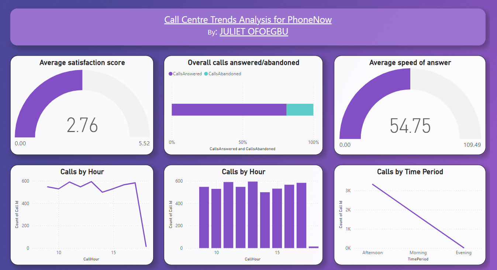
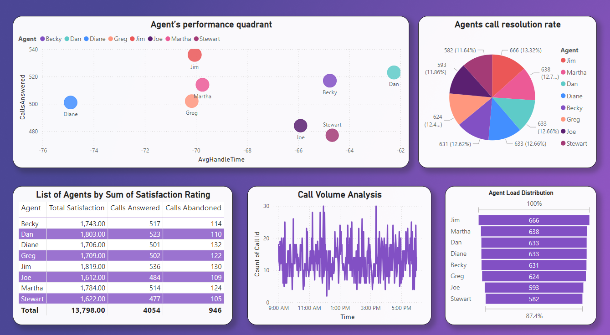

# CALL CENTER TRENDS FOR OMNIPRESENT - A TELECOM MARKETING AGENCY

Source: [PowerBI project by PW Switzerland on Forage](https://www.theforage.com/virtual-experience/a87GpgE6tiku7q3gu/pw-c-switzerland/power-bi-cqxg/call-centre-trends)

## Task: Create a dashboard in Power BI for Claire that reflects all relevant Key Performance Indicators (KPIs) and metrics in the dataset. Get creative! 

## Possible KPIs include (to get you started, but not limited to):
- Overall customer satisfaction
- Overall calls answered/abandoned
- Calls by time
- Average speed of answer
- Agent’s performance quadrant -> average handle time (talk duration) vs calls answered

## SOLUTION

### CLEANING DATA
- Replaced `null` values in the "Speed of answer in seconds" column to `0`
- Replaced `null` values in the "AvgTalkDuration" column to `01/01/1899`
- Replaced `null` values in the "Satisfaction rating" column to `0`

### Create Key Visuals

**1. Overall Customer Satisfaction**
- KPI or Gauge Chart: Created a measure to calculate the average satisfaction rating.
- Visualization: Use a KPI or Gauge Chart to display the overall customer satisfaction score.

**2. Overall Calls Answered/Abandoned:**
- Measure: Calculate the number of calls answered and abandoned.
- Visualization: Use a Stacked Bar Chart to compare answered vs. abandoned calls. Place CallsAnswered and CallsAbandoned on the values axis.

**3. Calls by Time:**
- Converted data type to 'time' from the 'date/time' type it was in by default
- Created a calculated column to extract just the hour or the time period (morning, afternoon, evening) from the "Time" column. Column giving me the hour of the call (0-23).
- Bar Chart for Hourly Distribution: Visualiation for the count of calls for each hour - to show the number of calls made during each hour of the day.
- Line Chart for Hourly Trends: Visualiation to display how the volume of calls fluctuates across different hours of the day.

**4. Average Speed of Answer:**
- Created a new measure for "Average Speed of Answer" - to calculate the average time it takes for calls to be answered, based on the values in the Speed of answer in seconds column
- Visualized with a Gauge Chart

**5. Agent’s performance quadrant -> average handle time (talk duration) vs calls answered**
- Created measures for "Average Handle Time" and "Calls Answered"
- Visualized using Scatter chart 

#### Extra KPI Visuals

**6. List of Agents by Sum of Satisfaction Rate**
- Measure created to show the total sum of satisfaction for each agent
- Visualized using Table - to show the total sum of satisfaction per agent

**7. Agents Call Resoultion Rate**
- Pie chart visualizing agents with the highest call resolution rate.

**8. Call Volume Analysis**
- Line Chart: To display the distribution of calls received by the time of day

**9. Agent Load Distribution**
- Funnel Chart to visualize the call load distributed among agents.

Visuals: 
 
 