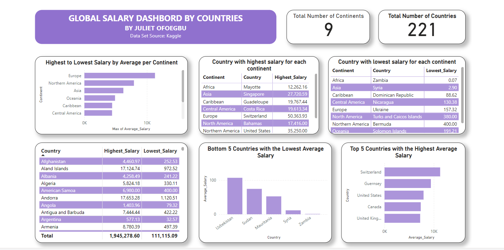

# Exploring Global Salary Trends: A Guide for Job Seekers

## Introduction
The decision to relocate to a different country for better job opportunities has always been a significant topic of interest. If you're seeking to relocate to a different country for reasons such as a better quality of life or new experiences, it's important salary trends across different countries and continents.

In this analysis, we'll look into global salary data to provide insights that can help you make informed decisions about where to pursue your career.

A point to note however is that the salaries listed are not definitive. It can differ according to cities within a country, job title, professional experience, and other factors. Also, this data analysis doesn't include the different job roles. It's just a general overview of salary ranges in the countries listed.

## Data Overview
Our dataset comprises key salary indicators from various countries across different continents. We have data on median, average, lowest, and highest salaries, along with the country and continent names. This comprehensive dataset allows us to explore salary disparities, identify trends, and highlight top-performing countries according to average salary earned by individuals.

## Key Questions and Insights
1. **Top 5 Countries with the Highest and Lowest Average Salaries**
- Visualization: Bar Chart
- Insight: This chart reveals the countries where job seekers can expect the highest and lowest average salaries. For instance, countries like Switzerland, the United States, and Australia might be top contenders for those seeking high-paying jobs, while other countries may offer lower average salaries but different perks and benefits.

2. **Continents Where People Earn More**
- Visualization: Bar Chart
- Insight: By comparing average salaries across continents, we see which regions offer the most lucrative opportunities. Europe and North America stand out as regions with higher average salaries, making them attractive destinations for job seekers.

3. **Highest to Lowest Average Salary Per Continent**
- Visualization: Bar Chart
- Insight: This chart provide a quick overview of the average salary in each continent, arranged from highest to lowest. This allows job seekers to compare potential earnings at a glance.

4. **Total Number of Countries and Continents in the Data**
- Visualization: Card Visuals
- Insight: These visuals give a sense of the dataset's scope.

5. **Highest Salary by Country in Each Continent**
- Visualization: Table
- Insight: Identifying the top-paying countries within each continent provides a view of where to look for high-paying jobs within a preferred region. For example, the United States in North America, Switzerland in Europe, Singapore in Asia, Mayotte in Africa, and Australia in Oceania might be top picks.

6. **Lowest Salary by Country in Each Continent**
- Visualization: Table
- Insight: Identifying the low-paying countries within each continent provides a view of countries with low-paying jobs within a preferred region. For example, the Bermuda in North America, Ukraine in Europe, Syria in Asia, Zambia in Africa, and Solomon Island in Oceania are countries that have the lowest average salary per continent.

## Detailed Analysis and Recommendations
### Descriptive Analysis
We begin by studying basic statistics to better understand the central tendency and distribution of earnings across countries and continents. This analysis aids in identifying outliers and general trends.

### Comparative Analysis
Comparing salaries across continents and countries enables us to identify regions with high earning potential. We evaluate average salaries and top salaries to determine which countries provide the best work possibilities for job seekers.

### Prescriptive Analysis
Based on the data, we make practical recommendations to job seekers. For example, if you work in certain fields, countries such as the United States and Switzerland may provide the best prospects due to high average earnings.

## Conclusion
Relocating for a job is an important decision that must be carefully considered, including prospective earnings. Job seekers can make informed selections that correspond with their career goals and financial objectives by using data on global salary trends. My analysis focuses on the highest-paying countries and continents, providing valuable insights for anyone looking to make a move.

However, the reported salaries are not definitive. It varies depending on localities within a country, job title, professional experience, and other criteria.

## Next Steps
- Explore the data and other external data to learn more about specific trends in your specific job sector.
- Consider more factors. While salary is important, consider the cost of living, quality of life, and other benefits before making a selection.
- Remeber that economic conditions and job markets are subject to change, so keep up with the latest information and trends.

## Visual Gallery
Gallery of the visualizations:
 